# CMPE275-CloudEventCenter

## Team
Adarsh Narasimha Murthy- 014952275 -adarsh.narasimhamurthy@sjsu.edu  
Anay Dilip Naik - 015217358 - anaydilip.naik@sjsu.edu  
Shreyas Kulkarni - 015966054 - shreyas.kulkarni@sjsu.edu  
Supreeth C - 015919566 - supreeth.chandrasekhar@sjsu.edu  

## Introduction

Cloud Event Center (CEC) is an online service to organize online or in-person events. Any
person or organization can post events in CEC, and those who are interested can sign up. We
also provide capabilities for potential participants to ask questions prior to the events, and share
moments with messages and pictures during and after the events. A reputation system will be
implemented to rate participants and organizers based on the feedback for each other.

## Technology Choices

- Frontend: HTML, CSS, JavaScript, React, MaterialUI
- Backend: Java, Spring, Google OAuth, JPA, JMS, Spring Security
- Database: MYSQL
- Cloud Service: AWS

## Architecture
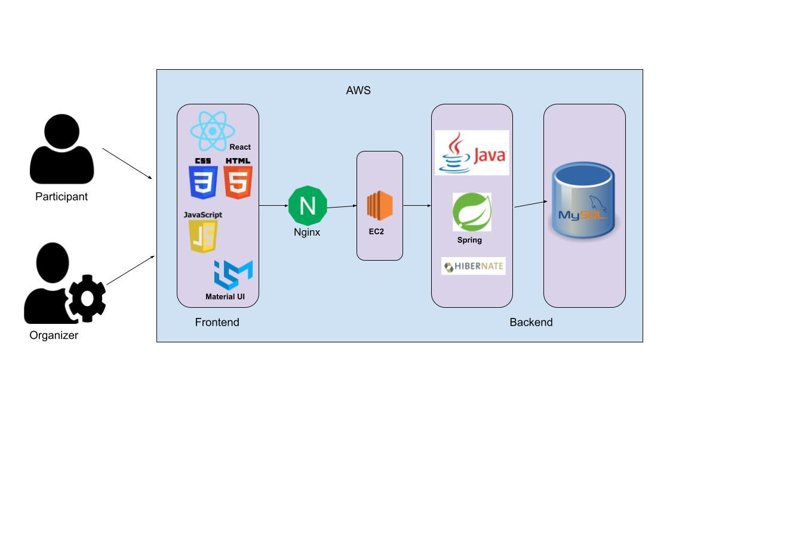

## Features and Screenshots
### User sign up
The user can sign up to the application in either of two ways
- Email
- Google account

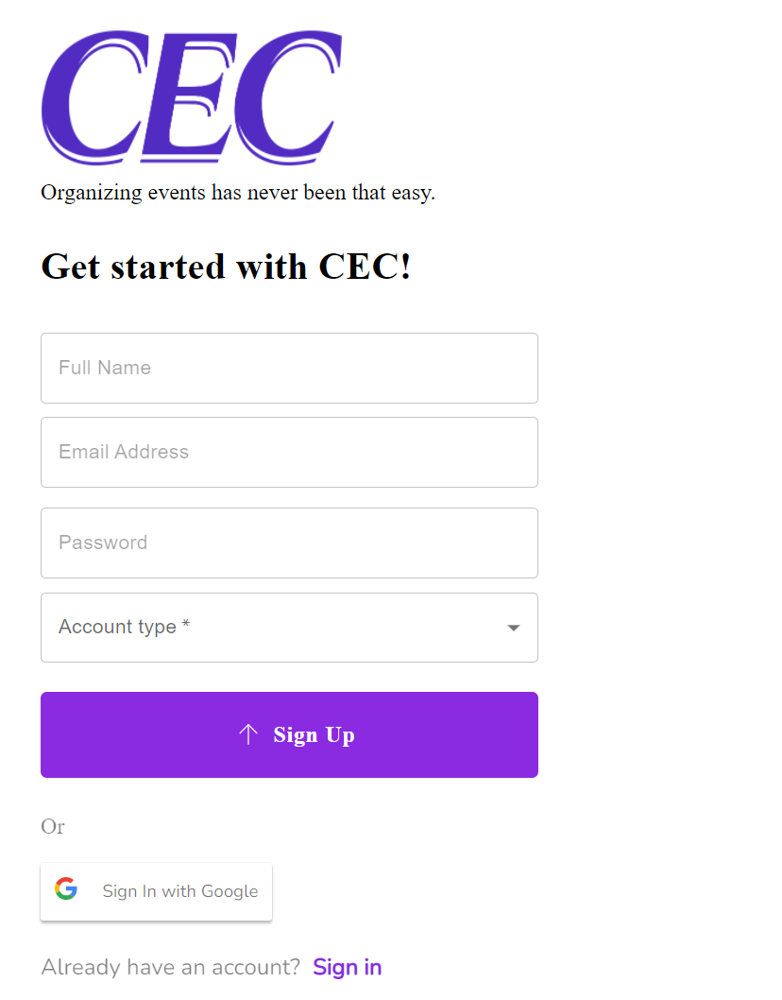
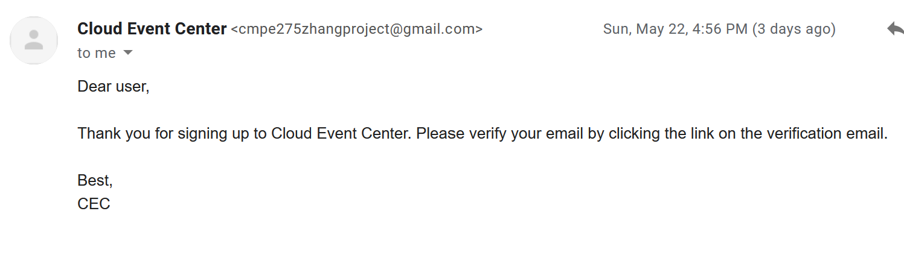
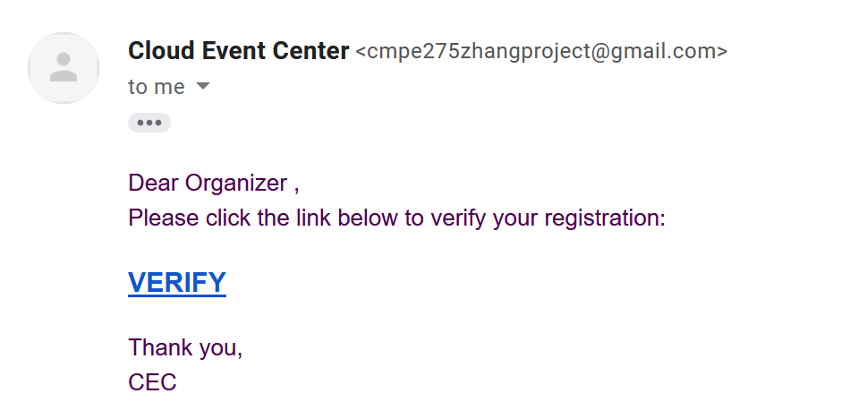

In both cases, an email will be sent to the user’s email address for verification. Only after
the account is verified, the user will be able to sign in the application

### Login

The user can login to the application in two ways, depending on the option that he chose
for registration. In case of standard email/password, the credentials will be compared
against the values in the database. In case of incorrect credentials, error will be thrown.
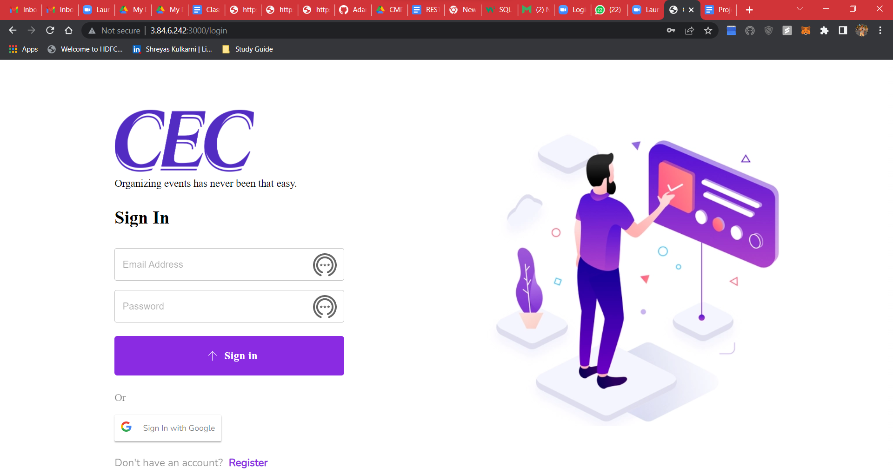
If the user chooses to sign-in through google, his oAuth token will be sent to google for
validation and on success he will gain access to the application.
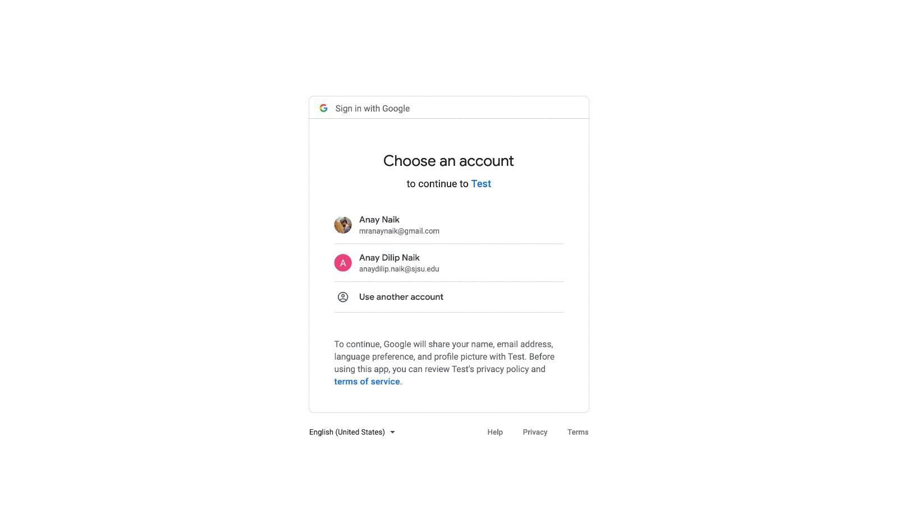

### Update User Information

When the user log’s in for the first time, he must provide below information:
- Full Name(*): full name of the user
- Screen Name(*): screen name that will be displayed on the profile
- Gender: optional, and applies to persons only.
- Description: optional text to describe the user.
- Address: Street and number (optional), City, State, Zip Code.
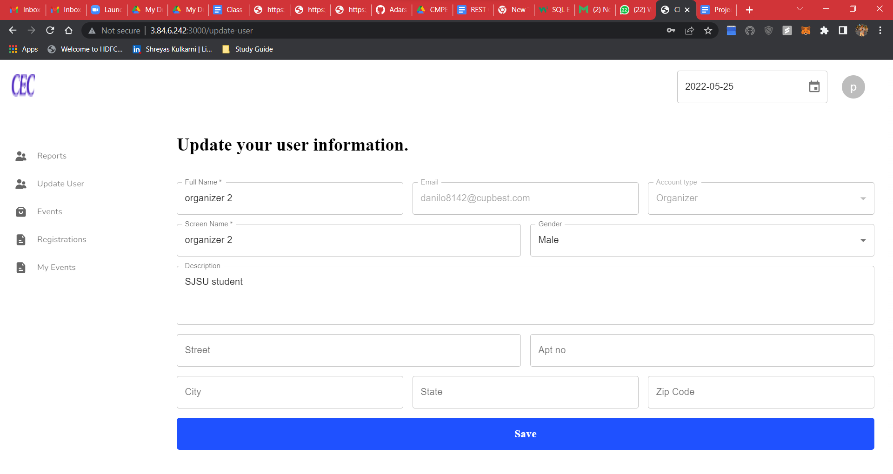

### Create New Event
Any user can create an event, he must provide the below information:
- Title: brief text to name the event.
- Descrition: text to describe the event.
- StartTime: date and time for the event to start. Must be in the future.
- EndTime: Must be after the start time.
- Deadline: date and time that participants must sign up before. A deadline
must be no later than the start time. This is also the time the sign-up
forum closes for new postings and entering read-only mode.
- Address: Street and number (optional), City, State, Zip Code.
- MinParticipants: (inclusive) the minimum number of participants that must
sign up before the deadline, or the event will be canceled.
- MaxParticipants: (inclusive) capacity of the event; if reached, no new
sign-ups are accepted.
- Fee: amount in USD. An event can either be free or paid - only an event
created by an organization can require a fee. If the fee is provided as 0, it
is assumed to be free.
- Admission Policy: Either ‘First come first server’ in which case approval is
not required by the user, or ‘Approval required’ when approval is required
by the organizer.
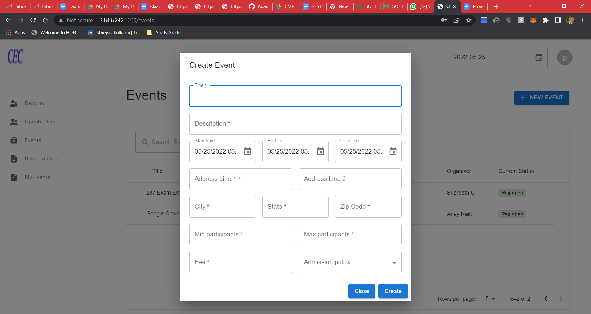
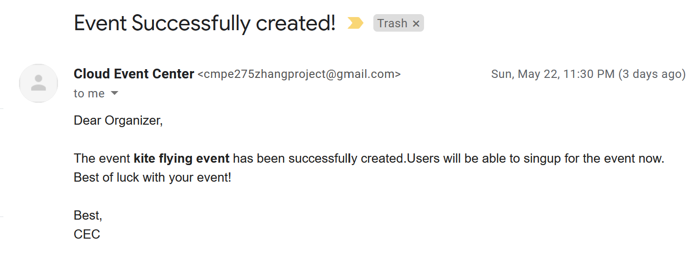

### Event Search
The user can search for available events and sign-up for them. He has the below filters
for searching:
- Location: It will be set to the user’s city by default. He can provide a different
value if required.
- Status: the following three statuses are allowed
  - Active: An event that has not been canceled and has not finished is considered
active.
  - OpenForRegistration : events that are open for registration
  - All : all events including past and canceled events.
- StartTime & EndTime: (EndTime is optional, defaults to infinite future) Only
events that occur within the given time window will be shown in the filtered
results. The StartTime defaults to the current time, if not given.
- Keyword: This search needs to partially match (be a substring of) against the title
and description fields. Case is ignored for matching. When not given, it is
ignored, hence matches everything.
- Organizer: this is used to partially match against (be a substring of) the screen
name of organizers, also in a case insensitive way. When not given, it matches
every organizer.
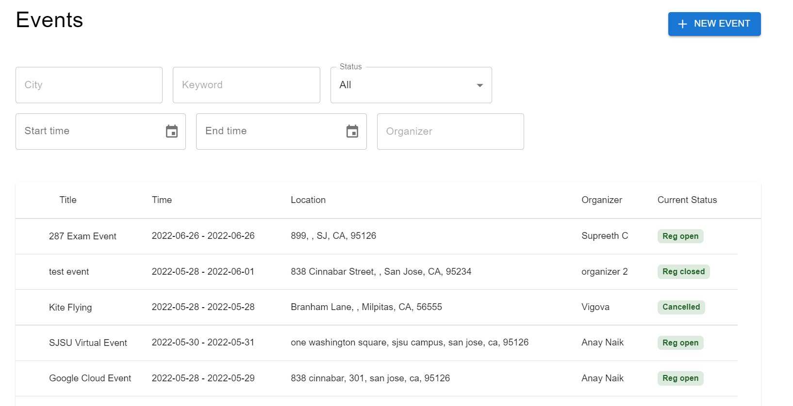

### Event Details
The user can view the details of the event such as Description, Min/max participants,
fee, current number of participants by clicking on the event in the event search results.
The user can even access the sign-up forum from here, where he can ask questions
about the event.
He can also view the reviews of the organizer for the event.
The user can register for the event by clicking on ‘Sign up for the event’.
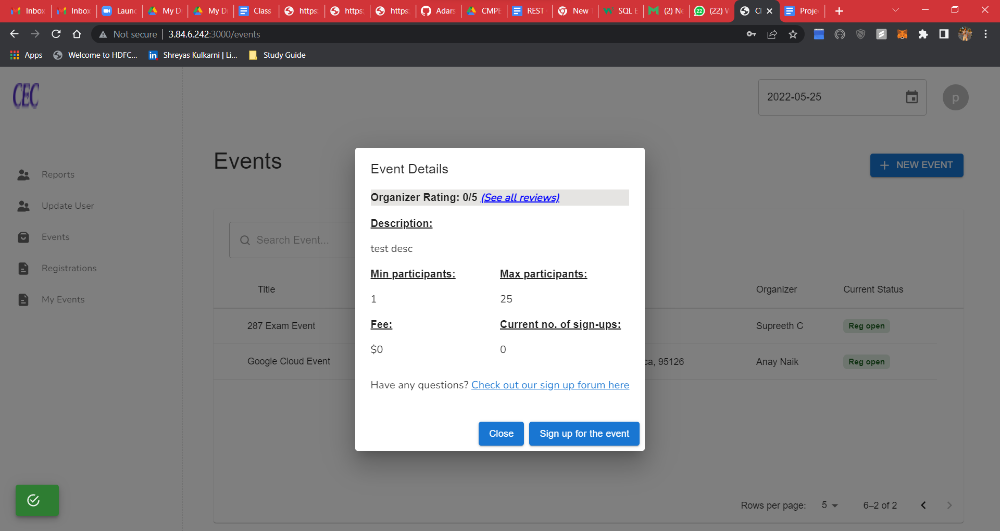

### Sign-up for events
After the user clicks on ‘Sign up for the event’, the user will be taken to a confirmation
screen. If the event involves any fee, a notification will be displayed below. Clicking on
‘Confirm’ registers the user to the event if the event has auto approval, else it is sent to
the organizer for approval.
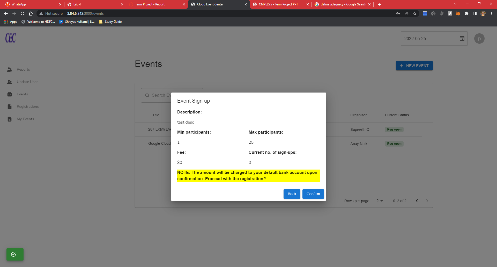

### Events page
The user can access all the events that he has registered for from ‘My events’ page. He
can even view the status of his registration from here.

### My events
The organizer can access all the events that he has organized from My events page. He
can approve/reject participants for the event from this page by clicking on any event.
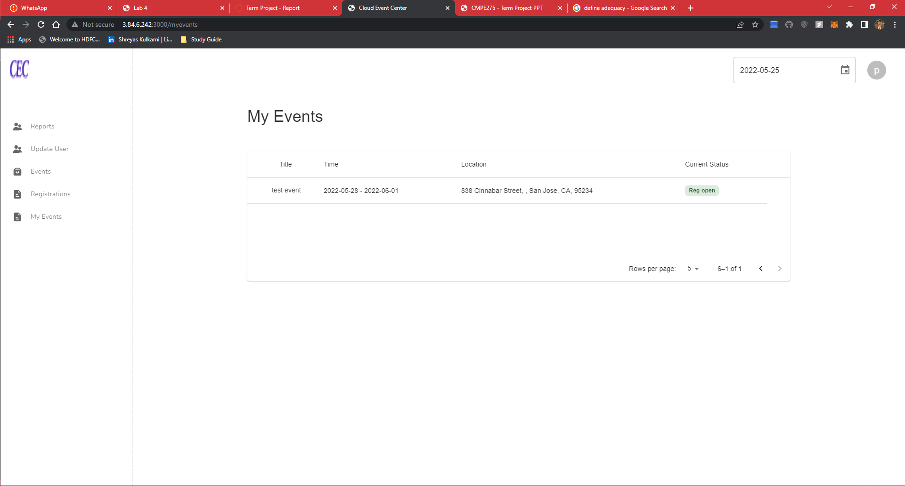

### Post a review
The organizer can post reviews for the participants who participated in the event,
likewise the participant can provide review for the organizer of the event.
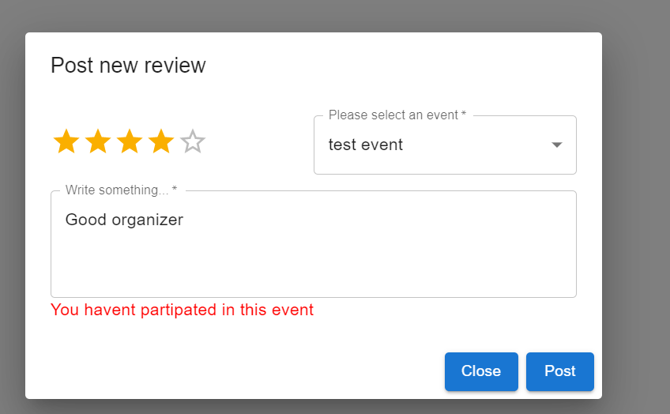

### Sign-up Forum
Sign-up forum is open to every user once the event has been created.
- Everyone can post questions and answer questions.
- Messages from the organizer are marked in the UI so that it is obvious that the
sender is the organizer.
- Messages should allow a mix of text and pictures.
- The sign-up forum becomes closed for posting of new messages once the event
registration deadline passes, or the event has been canceled.
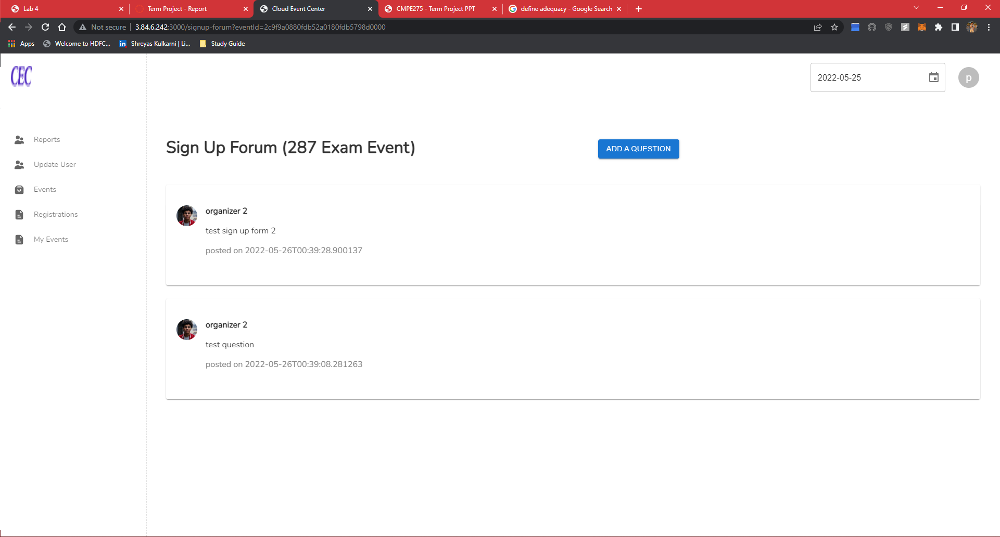
### Participant forum
User can post a question and add images if he/she wants

### Event Cancellation
An event will be auto canceled if it fails to have the minimum number of participants
before the event deadline. Email notification will be sent to all registered users, notifying
them of the cancellation.

### Reports
- System Report
System event report: available to every user. This report shows the following numbers of
from the last 90 days (based on the current virtual time):
  - Number of created events (based on creation time) and the percentage of paid
events.
  - Number of canceled events (based on registration deadline) and total number of
participation requests (regardless of approval or not) divided by the total number
of minimum participants for such events.
  - Number of finished events (based on finishing time), and the average number of
participants of these events.

- Participation report.
  - Number of signed-up events (based on singing-up time).
  - Number of rejects and approvals (based respective action time).
  - Number of finished events (based on finishing time).

- Organizer Report
  - Number of created events (based on creation time) and the percentage of paid events.
  - Number of canceled events (based on registration deadline) and total number of
  - participation requests (regardless of approval or not) divided by the total number of
minimum participants for such events.
  - Number of finished events (based on finishing time), and the average number of
participants of these events.
  - Number of paid events finished (based on finishing time) and total revenue from these
events.

### ER diagram
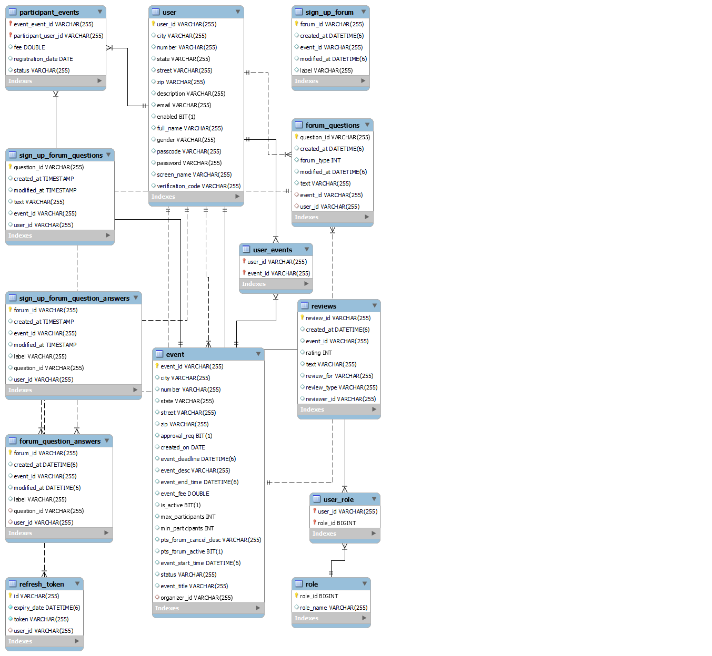

#### Handout:
https://docs.google.com/document/d/1I5RzW8oSG8j-u7z76YcrkVTgaqDQ3ExZfRD3iTy8cvw/edit

Draft Design: https://drive.google.com/drive/folders/1nwJnsl13Zx9kprfa8WlMa7blzWVfL8rS?usp=sharing

REST calls: https://docs.google.com/document/d/1zUmIVf6EVLA2TumIm0sXGqHX6oDX0NXbQhkEtomMVvc/edit
